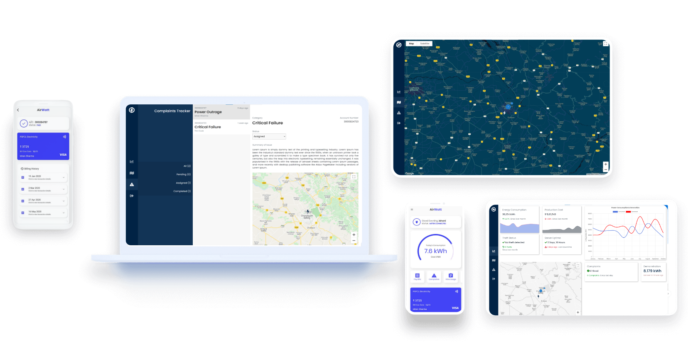
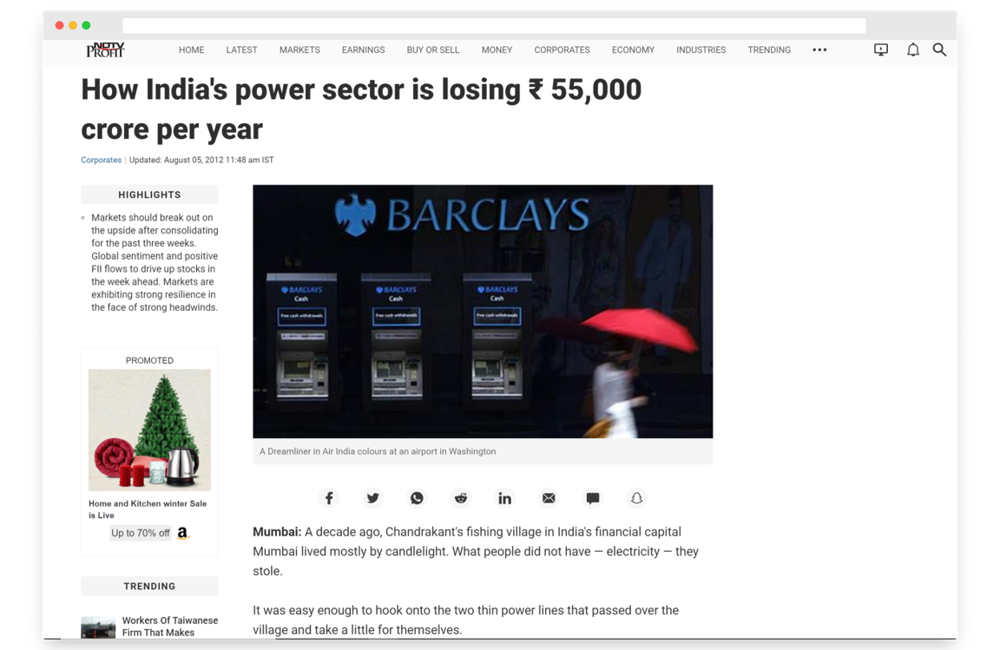
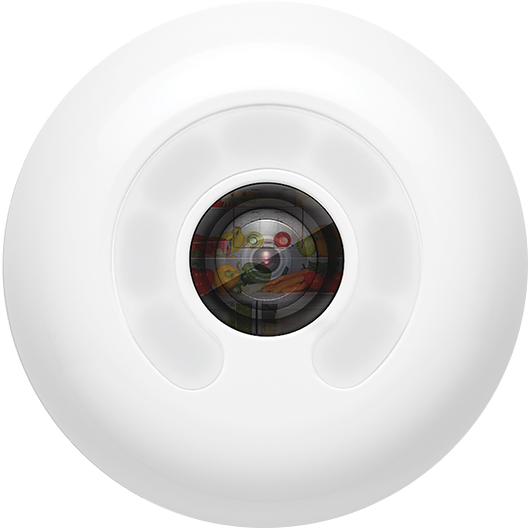
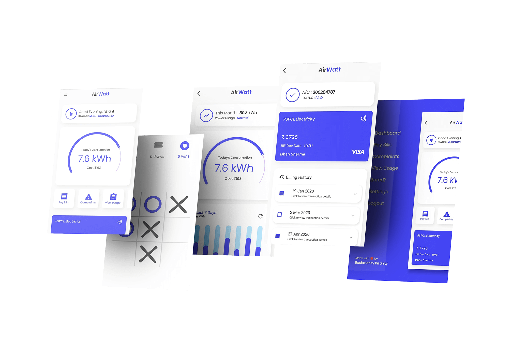

# AirPower

> All-in-one energy management solution.

### Live Demo

> You can take a look at the live deployed version of this project here.

<pre><a href="http://airpower.ishandeveloper.com">airpower.ishandeveloper.com</a></pre>

### Why do we exist?

According to this article from NDTV, India's Power companies lose more than Rs. 55,000 Crore every year due to electricity theft, meter tampering, power line manipulation and various other factors.

airpower helps you to solve these and many more!

### What's AirPower?

airpower is a collection of complete **end-to-end services**, based on top of an IOT device.

The IOT device can be installed in residences as a replacement for existing energy meters.

### The Device

We're using an ACS712 Sensor, along with an Arduino ESP8266, using which the input power readings are measured and uploaded to firebase.

### Services

We offer mainly two platforms for our services around the device, a web based admin dashboard and a flutter based companion app for consumers.

## Features

- <h4>Powerful dashboard</h4>
    
An incredibly powerful & intutive dashboard,for seamless integration between all the services.
    

- <h4>Complaints Tracker</h4>
    

    Keep on track with all the issues, that your consumers are facing, in a powerful yet simple way.
    

- <h4>Theft Detection</h4>
    

    Stay on track with all the issues, that your consumers are facing,in a powerful yet simple way.
    

- <h4>Map Clusters</h4>
    

    Realtime updates that can pan across a whole city, state or even a continent, helping you detect power fluctations, outrage etc.
    

- <h4>Perfect Companion</h4>
    

    Provide an immersive experience to your consumers, with our companion app.
    

#### Demonstration

> You can take a look at the demo video below on YouTube 

### The Geeks behind this 🤓

&ensp;&ensp;&ensp;
&ensp;&ensp;&ensp;

**by Team Muggles**
